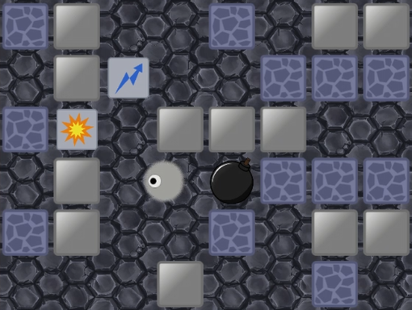

# Игра Bombize
Bombize – это мультиплеер, где 4 игрока пытаются взорвать друг друга с помощью бомб.\
Данная версия является рабочим прототипом и отражает основную механику.
В игре есть лобби, игровая комната и редактор карт. \
Видео-демонстрация прототипа доступна на [Яндекс.Диск](https://disk.yandex.ru/i/4sB_DR9c0GUhlA).

  

## Реализация

Сервер является асинхронным и многопоточным. Написан на C++ с использованием библиотек: \
boost (asio, beast, geometry, json), MySQL Connector/C++ (для связи с БД).

Клиент реализован на Unity 2022.3.40f1 (связь WebSocket через WebSocketSharp, UDP – через System.Net.Sockets).

Сетевое взаимодействие между клиентом и сервером осуществляется по двум протоколам:
+ WebSocket (основное) – используется для: входа в аккаунт, действий в лобби и получения результатов матча.
+ UDP (включается на время матча) – используется для передачи всех игровых действий.

Данные передаются в бинарном формате.
В качестве БД используется MySQL.

### Серверная часть

#### Обработка клиентов
При подключении нового клиента Server создаётся экземпляр `UserConnection`, который будет отвечает за обслуживание игрока.\
`UserConnection` сам контролирует время своей жизни.

Каждый экземпляр `UserConnection` взаимодействует с другими подсистемами через ссылку на `ServerServices`.

#### Организация матча

В текущей реализации происходит группировка комнат.
Каждая `RoomGroup` имеет свою нить исполнения `strand` и порт UDP (сокет в этом же контексте).
Количество комнат в группе задаётся в ServerConfig.json и её можно отключить (всё будет в одном `strand`).

#### Игровая комната

Каждая `Room` создаёт свой `GameContext` (набор подсистем) и отвечает за его обновление (в игровом цикле).\
Состав `GameContext`:

### Заключение
Это был первый опыт в написании мультиплеера, поэтому в проекте есть проблем,
которые будут мешать дальнейшему масштабированию.\
В планах переписать весь проект и использовать один язык C#.